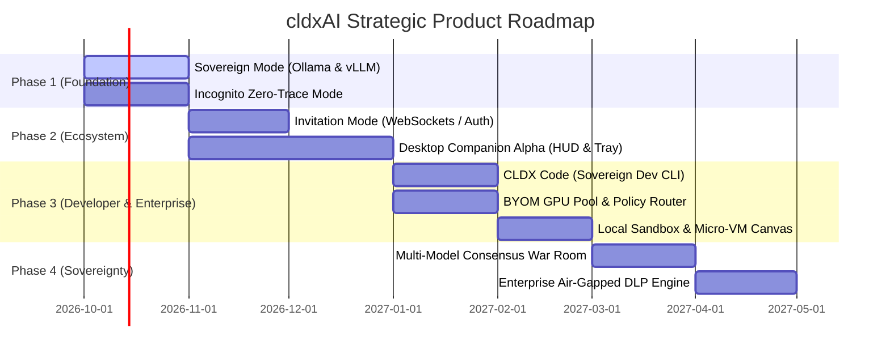

# CLDX.AI — Comprehensive Product & Feature Specification
### Next-Generation Sovereign, Collaborative & Desktop AI Control Plane

**Author & Founder:** Gyan Ranjan Panda  
**Product:** cldxAI (`cldx.ai`)  
**Document Version:** 2.0.0 (Enterprise & Investor Edition)  
**Date:** September 2026  
**Classification:** Confidential / Product Roadmap  

---

## Executive Summary

**cldxAI** is the unified enterprise AI control plane engineered for high-stakes environments—defense, government, legal, healthcare, and deep engineering. While traditional AI clients lock organizations into single cloud providers and force sensitive data over public APIs, **cldxAI** unifies frontier cloud models (Claude, Gemini) with air-gapped, sovereign infrastructure, real-time collaboration, and native operating system intelligence.

```
                          ┌──────────────────────────┐
                          │   CLDX.AI Control Plane  │
                          │   (Unified UI / Desktop) │
                          └─────────────┬────────────┘
                                        │
        ┌───────────────────────────────┼──────────────────────────────┐
        ↓                               ↓                              ↓
┌───────────────┐              ┌─────────────────┐             ┌────────────────┐
│  Cloud Mode   │              │ Sovereign Mode  │             │ Incognito Mode │
│ Claude/Gemini │              │ vLLM/Ollama/GPU │             │ Zero-Retention │
└───────────────┘              └─────────────────┘             └────────────────┘
```

---

## 1. Sovereign Mode (On-Device & Private Infrastructure AI)

### 1.1 The Problem
Government agencies, defense contractors, healthcare networks, and legal counsels operate under strict data residency mandates (e.g., India's **DPDP Act 2023**, **EU AI Act**, **HIPAA**, and **ITAR**). Cloud-only AI tools pose catastrophic compliance risks, forcing regulated sectors to either ban AI entirely or build fragmented, poor-UX internal solutions.

### 1.2 The Solution
A single, instant toggle within cldxAI switches the execution engine to **Sovereign Mode**:
- **Zero External Data Egress:** All prompts, context, and file embeddings remain confined to local RAM or the customer's on-premises GPU infrastructure.
- **Pluggable Inference Runtimes:** Out-of-the-box routing to **Ollama** (on-device Apple Silicon/NVIDIA), **vLLM**, or **SGLang** (enterprise server clusters).
- **Self-Hosted Local Vector Pipeline:** Embedded vector search driven by a local **Qdrant** instance or in-process HNSW index.
- **Local MCP (Model Context Protocol):** Local tools can query local databases, disk files, and internal APIs without external relay.

### 1.3 Enterprise Value
- **Regulatory Immunity:** 100% compliance with sovereign data localization laws.
- **Continuity in Air-Gapped Facilities:** Full AI agent functionality even with total internet severance.

---

## 2. Invitation Mode (Ephemeral Multiplayer AI Collaboration)

### 2.1 The Problem
AI is inherently single-player today. When team members want to collaborate on a complex AI prompt, code audit, or strategic brief, they are forced to copy-paste responses into Slack, losing live context, model parameters, and agent tool execution history. Sharing accounts exposes the owner's entire conversation archive.

### 2.2 The Solution
**Invitation Mode** enables time-limited, role-scoped collaborative AI war rooms:
- **Zero Archive Leakage:** The guest is admitted *strictly* to the designated thread; the owner's broader chat history and knowledge bases remain completely encrypted and invisible.
- **Time-Bounded Access Tokens:** Invitations are issued with cryptographically signed expiry windows (e.g., 30 minutes, 2 hours, 24 hours, or single-session).
- **Multi-Player Shared Context:** Both participants see real-time streaming tokens, agent thought trajectories, code previews, and artifact generation over WebSocket.
- **Air-Gapped Group Sessions:** When combined with Sovereign Mode, team members on the same local subnet (e.g., in a secure room or SCIF) can collaborate on local models with zero external connection.

### 2.3 Key Capabilities
| Capability | Owner | Invited Collaborator |
|---|---|---|
| Model Switching | Full control | Read-only or permitted list |
| Tool Invocation | Full control | Configurable permission |
| Token / Cost Quotas | Enforced on session | Shared from owner's pool |
| Revocation | Instant single-click kill switch | Access expires automatically |

---

## 3. Incognito Mode (Zero-Trace Ephemeral Inference)

### 3.1 The Problem
Even trusted cloud or local AI interfaces retain persistent chat history, caching embeddings, indexing semantic memories, and creating telemetry logs. For whistleblowers, journalists, M&A investment bankers, and executive boards handling sensitive corporate restructuring, any stored record on disk constitutes potential subpoena or leak liability.

### 3.2 The Solution
**Incognito Mode** provides guaranteed ephemeral execution:
- **RAM-Only Session State:** Context lives strictly in volatile memory. No disk persistence, no SQLite / MongoDB writes.
- **Bypassed Memory & Vector Indexing:** Semantic retrieval agents are disabled or isolated to an in-memory scratch index that self-destructs upon window close.
- **Zero-Telemetry Gateway:** Telemetry, audit analytics, and performance tracing hooks are suppressed.
- **Panic Wipe:** A dedicated hotkey (`⌘ + Shift + W`) instantly overwrites volatile memory buffers with cryptographic zeroes and redirects the interface to a neutral decoy screen.

---

## 4. CLDX Desktop Companion (Native OS Control & Ambient Context)

### 4.1 The Problem
Web browser-based AI tabs create extreme cognitive friction. Developers, researchers, and knowledge workers constantly juggle between IDEs, PDFs, terminal windows, and browser tabs, manually copying and pasting context.

### 4.2 The Solution
A lightweight, high-performance native desktop companion (built on Rust/Tauri) that integrates directly with macOS and Linux/Windows:

```
[ Active IDE / Browser / PDF ] 
              │ (Instant capture via ⌘ + Space)
              ▼
   ┌──────────────────────────────────────────────┐
   │        CLDX Desktop Floating HUD            │
   │ "Explain this crash stacktrace & fix diff"   │
   └──────────────────────┬───────────────────────┘
                          │
         ┌────────────────┴────────────────┐
         ▼                                 ▼
   [Local Code Patch]              [Terminal Command]
```

### 4.3 Core Desktop Features
- **Global Command HUD (`⌘ + Space` / `Alt + Space`):** Instant overlay palette accessible anywhere across the OS without switching windows.
- **Ambient Screen & Selection Context:** One-keystroke visual or text capture of the active window (code editor, terminal output, spreadsheet, or CAD blueprint).
- **Local Filesystem & Terminal MCP Bridge:** Direct, authorized integration with local development folders, git repositories, and shell commands.
- **Native System Tray Status:** Real-time visibility into local GPU memory, temperature, active Ollama/vLLM daemon states, and token-per-second metrics.

---

## 5. Additional Flagship Features (High-Impact Differentiators)

To elevate cldxAI far beyond any conventional AI client, the following strategic features complete the enterprise platform:

### 5.1 BYOM (Bring Your Own Model) & GPU Pool Scheduler
*Dynamic Enterprise Routing Matrix*
- Organizations register multiple model endpoints:
  - `Model A:` DeepSeek-R1 (Local H100 Cluster - High Security)
  - `Model B:` Kimi / Llama-3.3-70B (On-Premises RTX 6000)
  - `Model C:` Claude 3.7 Sonnet (Anthropic API - Public Data)
- **Policy Enforcement Engine:** Administrators define classification policies. If a prompt is tagged **Restricted / Confidential**, cldxAI hard-blocks all cloud endpoints and routes exclusively to approved on-premises GPU nodes matching context window requirements.

### 5.2 Local Sovereign Sandbox & Interactive Canvas
*Isolated On-Device Code Execution*
- Native execution of Python, TypeScript, SQL, and Shell scripts inside local isolated micro-containers (Docker / WebAssembly / Apple Sandbox).
- Code runs directly on the user's workstation without sending code or datasets to third-party execution servers.
- Interactive multi-page document generation (PDF reports, PowerPoint slides, SVG diagrams) rendered locally with zero latency.

### 5.3 Multi-Model Consensus War Room (Agent Swarm)
*Cross-Model Peer Review & Verification*
- Run heterogeneous models against the same mission-critical prompt:
  - **Generator Agent:** Claude 3.7 Sonnet drafts system design or contract clause.
  - **Critic Agent:** DeepSeek-R1 (Local) stress-tests edge cases and failure modes.
  - **Arbiter Agent:** Gemini 1.5 Pro reconciles discrepancies and produces verified output.
- Eliminates single-model hallucinations for high-stakes decision making.

### 5.4 Real-Time Enterprise Data Loss Prevention (DLP) Guardrails
*Pre-Flight Prompt & Response Sanitization*
- On-device NER (Named Entity Recognition) intercepts credit cards, API keys, Aadhaar/SSN numbers, and proprietary code variables before transmission.
- Automated token anonymization: Sensitive entities are replaced with deterministic synthetic tokens (`[ENTITY_01]`) before leaving the machine and reconstituted upon response arrival.

### 5.5 CLDX Code — Sovereign CLI & Local Agentic Coding Assistant
*Air-Gapped, Self-Hosted Developer Intelligence for Proprietary Codebases*
- **Local LLM Native:** Built specifically for engineers running self-hosted models (DeepSeek-Coder-V2, Qwen2.5-Coder, Starcoder2, Llama-Code) via Ollama, vLLM, or private SGLang GPU clusters in **Sovereign Mode**.
- **Zero IP Egress:** Allows defense, fintech, and enterprise developers to refactor, debug, and generate code on proprietary repositories without leaking intellectual property or credentials to cloud providers.
- **Terminal & IDE Integration:** Operates directly inside the developer terminal (CLI) and IDE companion window with autonomous capabilities:
  - Multi-file code edits with atomic rollback.
  - AST-aware repository indexing (Tree-sitter) executed 100% locally.
  - Local test-runner integration (executes tests, parses errors, and auto-repairs code locally).
- **Offline / Subnet Mode:** Operates with zero internet connectivity on air-gapped workstations or corporate intranet networks.
- **One-Command Activation:** A developer opens a repository in VS Code and types a single command — `cldx code`. Runtime discovery, model capability detection, context budgeting, and policy arming are fully automatic; there is no API key prompt, no model picker, and no configuration file to author first.
- **Small-Model Reliability Engine:** Self-hosted open models vary widely in tool-calling fidelity. CLDX Code probes the model at session start and selects an execution strategy accordingly — native tool API, grammar-constrained decoding (vLLM `guided_json` / llama.cpp GBNF), tag-based ReAct parsing, or an explicitly announced read-only mode. Degradation is always surfaced to the developer, never silent.
- **Fail-Closed Egress Policy (CODE-001 — CODE-005):** Extends the Sovereign Mode policy gate to the developer workflow: no cloud fallback during a local-runtime outage, stdio-only MCP transports (tool arguments in a coding agent *are* source code), shell allowlisting, and full telemetry suppression. Enforced centrally and verified by an automated socket-interception test suite.

> **Engineering specification:** see [`CLDX-CODE.md`](./CLDX-CODE.md) for the full decision-branch architecture, policy rules, VS Code transport design, and implementation order.

---

## 6. Architecture & Security Comparison Matrix

| Feature | Standard Cloud AI | Open-Source Web UIs | cldxAI Platform |
|---|:---:|:---:|:---:|
| **Frontier Cloud Intelligence (Claude / Gemini)** | ✅ Yes | ⚠️ API key only | ✅ Fully Native |
| **Air-Gapped Sovereign Execution** | ❌ No | ⚠️ Partial | ✅ Production-Grade |
| **Real-Time Timed Collaboration** | ❌ No | ❌ No | ✅ Invitation Mode |
| **Zero-Retention Ephemeral Privacy** | ❌ No | ❌ No | ✅ Incognito Mode |
| **OS-Level Desktop HUD (`⌘ + Space`)** | ⚠️ Limited | ❌ No | ✅ Native Integration |
| **Sovereign Agentic Coding (CLDX Code)** | ❌ Cloud-only | ⚠️ Basic scripts | ✅ Full Local Agent Loop |
| **Automated Enterprise DLP Filtering** | ⚠️ Cloud-only | ❌ No | ✅ Zero-Egress Local Pre-Flight |
| **Dynamic Multi-Cluster GPU Scheduling** | ❌ No | ❌ No | ✅ BYOM Pool Engine |

---

## 7. Product Phasing & Roadmap



---

## 8. Conclusion

**cldxAI** bridges the divide between uncompromised privacy and frontier intelligence. By uniting **Sovereign Mode**, **Invitation Mode**, **Incognito Mode**, **CLDX Code**, and **Desktop Integration** under one coherent experience, cldxAI creates the first true AI operating environment designed for modern enterprise sovereignty.

